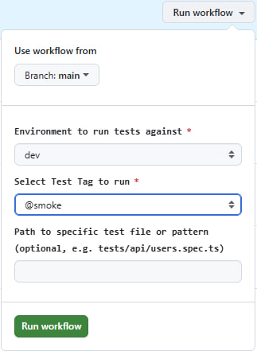

# 🎭 Playwright TypeScript Test Automation Framework


Showcast test automation framework built with **Playwright** and **TypeScript**. The project covers Web UI E2E testing, REST API, and GraphQL API automation with interactive Allure reporting and CI/CD integration via GitHub Actions.

---

## ⚡ Quick Start: Running Tests via GitHub Actions UI

You can trigger test suites directly from the **GitHub UI** without running any code locally or setting up a local environment.



### Steps to Run Tests in CI/CD:

1. Navigate to the **[Actions](../../actions)** tab in this repository.
2. Select the **Playwright Tests** workflow from the left sidebar.
3. Click the **Run workflow** button on the right.
4. Customize your run:
   - **Target Environment:** Choose `dev`, `stage`, or `prod`.
   - **Grep Tags:** Choose a tag (`@smoke`, `@api`, `@ui`, `@regression`, `@sanity`) or `all` to run the full suite.
   - **Test File:** Optionally provide a path/pattern (e.g. `tests/api/rest-users-crud.spec.ts`) to run only that spec.
5. Click **Run workflow** to start execution.

> The Allure report is published to **GitHub Pages** automatically after each run.

---

## 🛠️ Tech Stack

- **Core Engine:** [Playwright Test](https://playwright.dev/)
- **Language:** [TypeScript](https://www.typescriptlang.org/) (strict mode)
- **Linter / Formatter:** [oxlint](https://oxc.rs/) / [oxfmt](https://oxc.rs/)
- **Reporting:** [Allure Report](https://allurereport.org/) + Native Playwright HTML Report
- **Test Data:** [Faker](https://fakerjs.dev/)
- **Environment Management:** [dotenv](https://www.npmjs.com/package/dotenv)
- **CI/CD:** [GitHub Actions](https://github.com/features/actions) + GitHub Pages

---

## 🎯 Target Applications & Test Scope

The framework validates several public applications across a single Playwright project. Credentials and URLs are read from environment variables via `src/config/env.config.ts` (never hardcoded).

| Module | Target Application | Base URL | Covered by Tests |
| :----- | :----------------- | :------- | :--------------- |
| **REST API — Users** | [ReqRes](https://reqres.in) | `https://reqres.in/api` | `rest-users-crud.spec.ts`, `rest-users-auth.spec.ts`, `rest-users-pagination.spec.ts` |
| **REST API — Auth & RBAC** | [DummyJSON](https://dummyjson.com) | `https://dummyjson.com` | `rest-roles-auth.spec.ts` |
| **GraphQL API** | [Trevor Blades Countries](https://countries.trevorblades.com) | `https://countries.trevorblades.com` | `graphql-positive-cases.spec.ts`, `graphql-schema.spec.ts` |
| **Web UI — Auth & Roles** | [SauceDemo](https://www.saucedemo.com) | `https://www.saucedemo.com` | `auth-roles.spec.ts` |
| **Web UI — Storefront / Cart** | [Sauce Demo Store](https://sauce-demo.myshopify.com) | `https://sauce-demo.myshopify.com` | `cart.spec.ts` |

### What is covered per module

| Scope | Description | Test Type |
| :---- | :---------- | :-------- |
| **REST API — ReqRes (users)** | Create user, paginated listing (boundary value analysis), user deletion, login/register negative scenarios, 404 handling, role payload verification | API, Integration |
| **REST API — Auth & RBAC (DummyJSON)** | Login, authenticated profile endpoint (`/auth/me`), 401 on missing/invalid token, RBAC role verification | API, Auth, Security |
| **GraphQL API** | Valid queries with fragments, parameterized country/continent lookups, nested queries, schema/type validation errors, edge cases & malicious (SQL/XSS) payload handling | API, Schema |
| **Web UI E2E** | Parameterized login across user roles, unauthorized-access redirect, cart state verification | UI, E2E |

---

## 🏷️ Test Tagging & Local Execution

Tests are tagged for granular execution control.

### Available Tags

- `@api` — All API tests (REST & GraphQL)
- `@ui` — Web UI E2E tests
- `@smoke` — Critical smoke scenarios
- `@regression` — Full regression test suite
- `@sanity` — Sanity checks

---

## 💻 Local Execution Commands (CLI)

```bash
# Install dependencies & browsers
npm ci
npm run install:browsers

# Run ALL tests
npm test

# Run tests in Interactive UI Mode
npm run test:ui

# Launch Playwright Inspector (Debug mode)
npm run test:debug

# Run a single browser project
npm run test:chromium
npm run test:firefox
npm run test:webkit
```

### Tag-Filtered Execution (`--grep`)

```bash
# Run Smoke tests only
npx playwright test --grep "@smoke"

# Run API tests only
npx playwright test --grep "@api"

# Run UI tests only
npx playwright test tests/ui

# Run API tests only (by folder)
npx playwright test tests/api

# Run tests containing BOTH @api AND @smoke
npx playwright test --grep "(?=.*@api)(?=.*@smoke)"

# Run @api tests EXCLUDING @smoke
npx playwright test --grep "@api" --grep-invert "@smoke"

# Run a specific test file
npx playwright test tests/api/rest-users-crud.spec.ts
```

### Lint & Typecheck

```bash
# Typecheck the project
npx tsc --noEmit

# Lint with oxlint
npx oxlint .

# Format with oxfmt
npx oxfmt .
```

---

## 📊 Test Reporting

The framework supports both Allure Report and the native Playwright HTML report.

### Allure Report (Local)

```bash
# Generate a temporary Allure report and open it in the browser immediately
npm run allure:serve

# Generate static HTML report from allure-results
npm run allure:generate

# Open a previously generated report from allure-report folder
npm run allure:open
```

### Native Playwright HTML Report

```bash
# Open the default Playwright HTML report
npm run report
```

---

## ⚙️ CI/CD Pipeline (GitHub Actions)

Integrated via `.github/workflows/workflow.yml`.

**Automated Triggers:**
- **Push / Pull Request** on `main`, `master`, `dev` → runs the `@smoke` suite against the matching environment (`main`/`master` → prod, `dev` → dev, other → stage).
- **Scheduled** nightly run (`cron`) → runs the full `@regression` suite against prod.
- **Manual (`workflow_dispatch`)** → environment, tag, and file selection from the GitHub UI.

**Report Deployment:** The generated Allure report is uploaded as a Pages artifact and deployed to **GitHub Pages** on every run (`if: always()`).

---

## 📁 Repository Structure

```text
.
├── .github/
│   ├── assets/                # Documentation images
│   └── workflows/             # GitHub Actions CI/CD workflow
├── tests/
│   ├── api/                   # REST & GraphQL API test specifications
│   └── ui/                    # Web UI E2E test specifications
├── src/
│   ├── api/
│   │   ├── clients/           # API clients (User, Auth, GraphQL, Base)
│   │   ├── data/              # Test data & fixtures
│   │   ├── factories/         # Faker-based payload factories
│   │   ├── fixtures/          # Playwright API fixtures
│   │   ├── models/            # TypeScript interfaces/DTOs
│   │   └── queries/           # GraphQL queries & fragments
│   ├── config/                # Environment configuration
│   └── ui/
│       ├── components/        # Reusable UI components
│       ├── data/              # UI test data
│       ├── fixtures/          # Playwright UI fixtures
│       └── pages/             # Page Object Models
├── .env.example               # Environment variables template
├── .gitignore
├── CLAUDE.md                  # Project guidelines for AI assistants
├── package.json               # Scripts & dependencies
├── playwright.config.ts       # Playwright configuration
└── tsconfig.json              # TypeScript configuration
```
